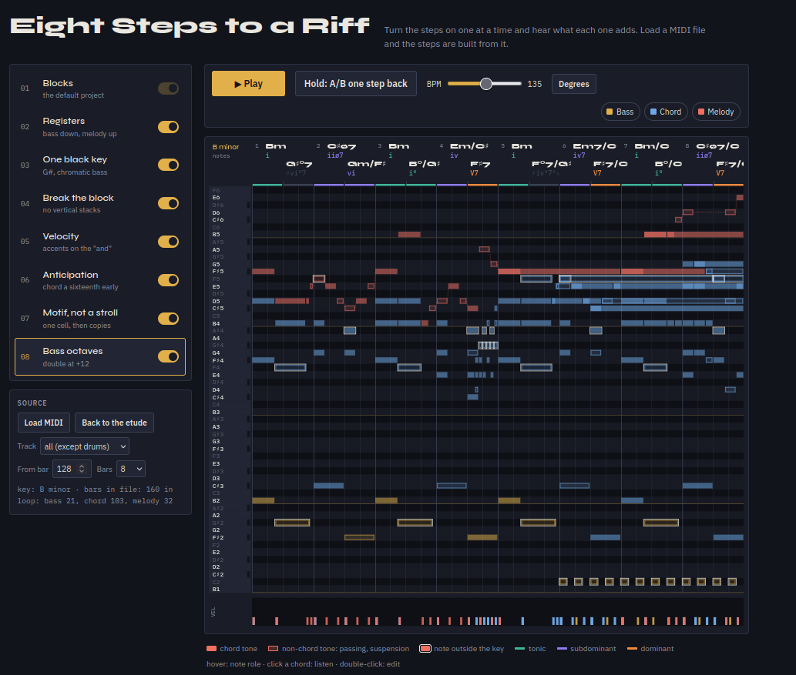

# Chord to Riff

Piano roll that shows how block chords become a film-score riff, one toggle at a time. Loads your MIDI, labels every chord.



## Try it

```bash
git clone https://github.com/delawer33/chord-to-riff.git
open chord-to-riff/index.html
```

One HTML file, no build, no server. Demo MIDI: [examples/demo-riff.mid](examples/demo-riff.mid).

## What it does

- Eight switchable steps: blocks, registers, one black key, broken chords, velocity, anticipation, motif, bass octaves
- Hold A/B to hear the previous step
- Chord name and Roman numeral for every half bar: `E/G♯`, `V⁶`
- Colour by function: tonic, subdominant, dominant
- Note roles: chord tone, passing, neighbour, suspension, outside the key
- Hover a note for a one-line explanation, click a chord to hear it
- Keyboard with note names or scale degrees, scale notes brighter
- MIDI import: detects key and tempo, rebuilds all eight steps from your file

## How it works

- Key: Krumhansl pitch-class profile plus votes from the bass on downbeats
- Chords: every triad, seventh and sus template scored per half bar; the bass picks the slash, not the chord
- Voices: highest note is melody, lowest is bass, the rest is chord
- Note roles: chord tone, else passing, neighbour or suspension by the surrounding notes and beat strength

All heuristic. Wrong chord? Double-click the label and type the right one. Fixes are saved in the browser.

## Roadmap

- Harmony tab: from bare Roman numerals to the finished riff
- Per-bar constructor: white-key version next to the original, each change toggleable
- Device detection: chromatic bass, pedal points, sequences

## License

MIT
